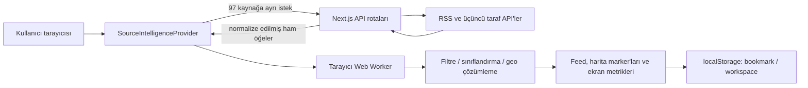
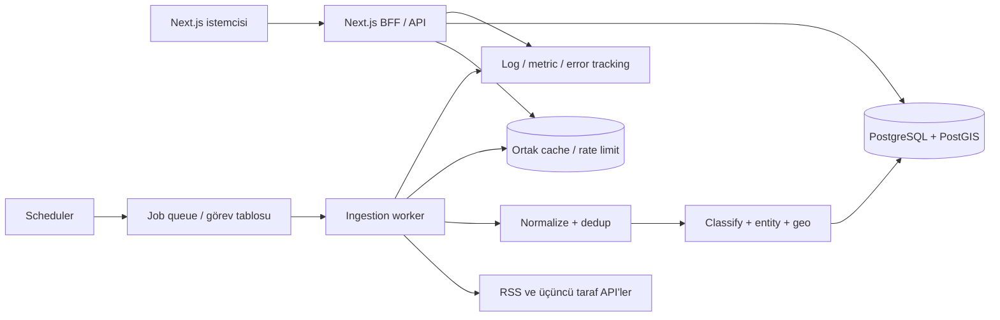

# ECHIS Backend Geçiş ve Canlıya Alma Raporu

> İnceleme tarihi: 20 Temmuz 2026  
> Kapsam: Mevcut kod tabanının backend gereksinimleri, canlı ortam riskleri, hedef mimari, veri modeli, API taslağı ve uygulama sırası  
> İncelenen temel alanlar: `app/api/**`, `components/**`, `data/**`, `lib/**`, `types/**`, `next.config.ts`, `package.json`

## 1. Yönetici özeti

ECHIS bugün yalnızca bir frontend değildir. Tek bir Next.js uygulaması içinde toplam **14 sunucu API rotası**, RSS/API adaptörleri, üçüncü taraf servis anahtarlarının sunucuda tutulması, timeout, kısa süreli bellek içi cache, in-flight istek birleştirme ve bazı stale-data fallback mekanizmaları zaten bulunmaktadır.

Bununla birlikte mevcut yapı, çok kullanıcılı ve güvenilir bir canlı ürün backend'i değil; daha çok çalışan bir **BFF/proxy prototipi** düzeyindedir. Temel nedenler şunlardır:

- Kaynak toplama işlemi uygulama açıldığında tarayıcı tarafından tetiklenmektedir. İlk açılışta Global View için 97, Cyber News için 18, Defense Industry için 14 ve Policy için 17 kaynak isteği başlatılabilir; yani soğuk bir oturumda aynı uygulamanın API rotalarına **146'ya kadar istek** oluşabilir.
- Haberlerin normalizasyon sonrası filtrelenmesi, sınıflandırılması, puanlanması ve coğrafi eşlemesi tarayıcıdaki Web Worker içinde yapılmaktadır. Sonuçlar merkezi olarak saklanmamaktadır.
- Veritabanı, kullanıcı hesabı, yetkilendirme, ortak çalışma alanı, sunucu taraflı yer imi, kalıcı kaynak geçmişi, merkezi rate limit, job queue ve üretim gözlemlenebilirliği yoktur.
- Sunucu cache'leri işlem belleğindedir. Serverless cold start, yeniden deploy veya birden fazla instance durumunda cache ve kilitler paylaşılmaz.
- SOCMINT verileri mock'tur; ana Monitor ekranındaki sinyaller rastgele üretilmektedir; Contact formu veri göndermeden yalnızca sahte bir referans numarası üretmektedir.

### Sonuç

ECHIS'in mevcut Next.js yapısı korunabilir; ilk aşamada ayrı ve büyük bir backend monoliti veya mikroservis ağı kurmak gerekmez. Önerilen hedef şudur:

1. Next.js Route Handler'ları web uygulamasının BFF/API katmanı olarak korumak.
2. Kaynak toplama ve analiz işini kullanıcı isteğinden ayıran zamanlanmış bir worker oluşturmak.
3. Kalıcı veri için PostgreSQL, konumsal sorgular için PostGIS kullanmak.
4. Dağıtık cache, rate limit ve görev kilidi için Redis veya PostgreSQL tabanlı ortak kilit mekanizması eklemek.
5. Tarayıcının yüzlerce kaynak isteği yapması yerine, veritabanından cursor ile sayfalayan tekil okuma API'leri sunmak.
6. Yazma işlemlerini kullanıcı/organizasyon yetkisiyle korumak.

Canlıya çıkış modeli ikiye ayrılmalıdır:

| Yayın modeli | Gerekli minimum backend |
|---|---|
| Herkese açık, yalnızca okunur demo | Mevcut proxy rotaları + merkezi rate limit/cache + gerçek veya kaldırılmış Contact formu + hata izleme + mock/simülasyon etiketleri + kaynak kullanım şartları kontrolü |
| Operasyonel, hesaplı ve çok cihazlı ürün | Yukarıdakilere ek olarak auth, PostgreSQL/PostGIS, ingestion worker, kalıcı event arşivi, sunucu taraflı bookmark/workspace, RBAC, audit log ve yedekleme |

Bu iki model karıştırılmamalıdır. “Yer imlerim cihazlar arasında eşitlensin”, “Intel Watch çalışma alanını ekip paylaşsın”, “geçmiş olaylar aranabilsin” veya “alarm üretelim” beklentilerinden biri varsa veritabanı ve kullanıcı sistemi zorunludur.

---

## 2. Mevcut sistemin teknik fotoğrafı

### 2.1 Kullanılan yapı

- Next.js 16 App Router ve React 19
- TypeScript
- Next.js Route Handler tabanlı sunucu API'leri
- Sunucu tarafında RSS ve haber API adaptörleri
- Tarayıcı tarafında source-intelligence Web Worker pipeline'ı
- Harita/küre için MapLibre ve Three.js tabanlı ekranlar
- Kullanıcı verisi için yalnızca `localStorage`
- Kalıcı veritabanı, ORM, auth, queue, Redis ve gözlemleme SDK'sı bulunmuyor
- CI workflow ve çalıştırılabilir bir `npm test` komutu bulunmuyor

### 2.2 Mevcut veri akışı



Bu akış prototipte çalışır; ancak her kullanıcının aynı toplama ve analiz işini tekrar yaptırması nedeniyle üretimde pahalı, ölçülmesi zor ve tutarsızdır.

### 2.3 Mevcut güçlü yönler

Aşağıdaki parçalar backend geçişinde yeniden kullanılabilecek kadar değerlidir:

- API anahtarları `process.env.*` üzerinden yalnızca sunucuda okunuyor; client bundle'a taşınmıyor.
- Kaynak adaptörleri ayrıştırılmış durumda: `lib/sources/*Adapter.ts`.
- Uçak sağlayıcıları tek tipe normalize ediliyor: `types/airtrack.ts` ve `lib/airtrack/**`.
- RSS route'u keyfi URL kabul etmiyor; `sourceId` allowlist'i kullanıyor.
- RSS response boyutu 3 MB ile, öğe sayısı kaynak başına 150 ile sınırlı.
- Kaynak rotalarında timeout, 5 dakikalık cache, aynı isteği birleştirme ve son iyi veriyi stale sunma desenleri mevcut.
- Global intelligence pipeline'ı normalize, filtre, sınıflandırma, konum çözümleme ve marker üretimi olarak modülerleştirilmiş.
- Cyber, Policy ve Defense analiz motorları UI'dan ayrılmış `lib/**` modüllerinde bulunuyor; worker'a taşınabilir.
- Air Track tarafında sağlayıcı birleştirme, konum tazeliği ve stale frame davranışı düşünülmüş.
- Temel HTTP güvenlik başlıkları `next.config.ts` içinde mevcut.

---

## 3. Mevcut sunucu API envanteri

Kod tabanında toplam 14 GET rotası vardır.

| Grup | Rotalar | Mevcut işlev | Mevcut koruma | Eksik üretim katmanı |
|---|---|---|---|---|
| Haber API'leri | `/api/sources/currents`, `newsdata`, `worldnews`, `freenews`, `finlight`, `guardian`, `gdelt`, `reliefweb` | Üçüncü taraf kaynağa istek, normalize yanıt | Server-only anahtar, timeout, bellek cache, in-flight birleştirme, çoğunda stale fallback | Auth/politika, dağıtık cache, kullanıcı/IP rate limit, merkezi log/metric, kalıcı arşiv |
| RSS | `/api/sources/rss-preview?sourceId=...` | 130 kayıtlı RSS kaynağından allowlist ile veri çekme | Allowlist, timeout, 3 MB sınır, öğe sınırı, bellek cache, stale fallback | Redirect sonrası egress/SSRF kontrolü, dağıtık cache/lock, public endpoint yerine internal ingestion |
| Air Track | `/api/airtrack/mil`, `/global`, `/region`, `/lookup/[hex]` | ADS-B/OpenSky verisini normalize etme ve zenginleştirme | Parametre sınırları, upstream cooldown, TTL cache, stale frame, lookup regex kontrolü | Dağıtık kota yönetimi, istemci rate limit, erişim politikası, paylaşılan cache, kullanım şartları/retention kararı |
| Saat dilimi | `/api/client-timezone` | İstemci IP'sini FindIP ile saat dilimine çevirme | Private IP filtresi, timeout, 5.000 girişli bellek cache | KVKK/gizlilik kararı, üçüncü tarafa IP aktarım politikası, tercihen tarayıcı `Intl` ile backend ihtiyacını kaldırma |

### API katmanında gözlenen ortak sınırlamalar

- Rotalar anonim olarak erişilebilir.
- Uygulama seviyesinde IP/kullanıcı bazlı rate limit yoktur. GDELT ve Air Track'teki cooldown'lar upstream kota korumasıdır; kötüye kullanan istemciyi sınırlamaz.
- Route cache ve in-flight promise'ları yalnızca çalışan Node.js process'ine aittir.
- Hata formatları standart değildir; bazı rotalar `{ error }`, bazıları `{ error, reason }`, bazıları doğrudan upstream mesajı döndürür.
- İstek ve yanıt doğrulaması için ortak bir schema katmanı yoktur.
- Request ID, structured log, merkezi metric ve trace yoktur.
- API versiyonlaması ve cursor pagination yoktur.
- Kaynaklar kullanıcı isteği anında upstream'den çekilir; ingestion ile read path birbirinden ayrılmamıştır.

---

## 4. Ekran bazında backend ihtiyacı

| Ekran/özellik | Bugünkü veri ve kalıcılık | Canlıdaki backend ihtiyacı | Öncelik |
|---|---|---|---|
| Monitor ana ekranı | Bölgesel sayılar statik; küre sinyalleri her 6,8 saniyede tarayıcıda rastgele üretiliyor | Gerçek özet metrik API'si veya açık ve kalıcı “simülasyon/görsel efekt” etiketi | P0 |
| Global View | 97 aktif kaynak tarayıcıdan API rotalarına çağrılıyor; sınıflandırma ve geo pipeline tarayıcı worker'ında | Merkezi ingestion worker, kalıcı normalized item/event tablosu, server-side analiz, cursor feed ve bbox marker API'si | P0 |
| SOCMINT Watch | `data/socmintReports.ts` içinde 22 mock rapor | Gerçek public-source adapter'ları, kaynak izinleri, review/verification workflow'u ve edit history; aksi halde ekranı demo olarak açıkça etiketleme veya yayında kapatma | P0 |
| Air Track | Gerçek ADS-B/OpenSky proxy'leri; client polling | Dağıtık cache/kota kilidi, rate limit, erişim politikası, gözlemleme; geçmiş saklanacaksa ayrı retention ve lisans kararı | P0/P1 |
| Cyber News | 18 RSS kaynağı; kaynaklar client'ta birleştiriliyor, analiz client'ta | Tek backend feed endpoint'i, merkezi dedup/sınıflandırma, kalıcı sonuçlar ve kaynak sağlık takibi | P0 |
| Defense Industry | 14 RSS kaynağı; analiz client'ta | Cyber ile aynı ortak ingestion altyapısı ve domain projection/read model | P0 |
| Policy | 17 RSS kaynağı; analiz ve state-affiliation işaretleme client'ta | Merkezi policy classification, kaynak metadata yönetimi, kalıcı arşiv ve cursor API | P0 |
| Sources | Yalnızca o tarayıcı oturumundaki istek/başarı/hata sayıları gösteriliyor | Kalıcı `source_fetch_runs`, son başarı/hata, latency, item sayısı ve admin refresh/disable kontrolü | P1 |
| Intel Watch | Pin ve çizimler `echis.intel-watch.v1` anahtarıyla `localStorage`'da; GeoJSON import/export var | Tek cihazlı kişisel kullanımda backend şart değil. Çok cihaz/ekip için workspace, feature, version, ownership ve paylaşım API'si | P1 |
| Bookmarks | SOCMINT ID'leri ve source snapshot'ları `localStorage`'da | Hesaplı üründe kullanıcıya bağlı bookmark tablosu ve sync API; public demoda local kalabilir | P1 |
| Contact | Form submit işlemi veri göndermiyor; tarayıcıda rastgele `ECH-####` üretip başarılı gösteriyor | Gerçek `/api/contact` endpoint'i, doğrulama, spam koruması, ticket kaydı veya e-posta relay'i, hata durumu ve retention politikası | P0 |
| Kullanıcı/avatar/Exit | `AB` sabit; Account ve Exit “coming soon” | Yayın modeli davetliyse auth, session, logout ve RBAC | P0 veya kapsam dışı |
| Ship Track / Analytics | “Soon”, işlev yok | İlk backend sürümünün parçası olmamalı; veri sağlayıcısı ve ürün gereksinimi netleşince | P2 |

### Önemli doğruluk notu

Cyber News, Defense Industry ve Policy ekranları güncel kodda mock veri değil, canlı RSS kaynakları kullanmaktadır. Buna karşılık Monitor ana ekrandaki ambient sinyaller ve SOCMINT raporları simüle/mock veridir. Canlı üründe bu ayrım kullanıcıya açıkça gösterilmelidir.

---

## 5. Canlıya çıkışı engelleyen veya ciddi risk oluşturan bulgular

### B-01 — Toplama işinin tarayıcı tarafından başlatılması — P0

`SourceIntelligenceProvider` mount olduğunda 97 aktif kaynağı ayrı ayrı çağırıyor. Aynı anda `AppShell` Cyber, Defense ve Policy cache'lerini de 49 ayrı istekle ısıtıyor. Server cache upstream yükünü bir miktar azaltmasına rağmen:

- 146'ya kadar uygulama API çağrısı yine ağ ve serverless invocation maliyeti oluşturur.
- Her yeni kullanıcı aynı read-path işini tekrar tetikler.
- Cold start veya çoklu instance durumunda upstream cache paylaşılmaz.
- Bazı kaynakların yavaşlaması kullanıcı deneyimini doğrudan etkiler.
- Kaynak toplama ile kullanıcıya veri sunma birbirinden bağımsız ölçeklenemez.

**Gerekli değişim:** Kaynakları scheduler/worker toplamalı; kullanıcı yalnızca veritabanına dayanan birkaç toplu read endpoint'ini çağırmalıdır.

### B-02 — Kalıcı veri ve geçmiş yok — P0

Haber öğeleri, analiz sonuçları, event candidate'lar ve kaynak sağlık bilgileri process veya browser belleğinde yaşar. Bu nedenle:

- Deploy/restart sonrası geçmiş kaybolur.
- “Son 24 saat”, trend ve karşılaştırma güvenilir biçimde üretilemez.
- Aynı öğe farklı kullanıcılarca yeniden analiz edilir.
- Editoryal düzeltme, review ve audit izi tutulamaz.
- Kaynak kapandıktan sonra ona ait önceki kayıtlar aranamaz.

**Gerekli değişim:** Normalize item, event, konum, sınıflandırma ve fetch-run sonuçları PostgreSQL'de saklanmalıdır.

### B-03 — Auth ve yetkilendirme yok — P0, ürün modeline bağlı

Kodda auth/session sağlayıcısı, login route'u veya kullanıcı/rol modeli yoktur. Avatar sabittir ve Exit pasiftir. Public read-only yayın için auth zorunlu değildir; fakat bookmark sync, workspace paylaşımı, admin kaynak yönetimi, iletişim kayıtları veya alarm tanımı varsa auth zorunludur.

**Önerilen roller:** `owner`, `admin`, `analyst`, `viewer`. Yetki kontrolü sadece UI'da değil her yazma/admin endpoint'inde yapılmalıdır.

### B-04 — Dağıtık rate limit ve ortak kota yönetimi yok — P0

Mevcut cooldown değişkenleri instance belleğinde olduğu için yatay ölçeklemede her instance upstream'e ayrı istek yapabilir. Ayrıca anonim kullanıcı aynı endpoint'i çok sık çağırabilir.

**Gerekli değişim:** Route grubu bazında Redis/ortak store rate limit, ingestion job'larında distributed lock ve upstream başına kota politikası.

### B-05 — Contact formu gerçek değil — P0

Formun submit fonksiyonu alan değerlerini okumadan `Math.random()` ile referans üretir ve başarı ekranı gösterir. Ekrandaki “secure intake relay” ifadesi mevcut davranışla teknik olarak doğru değildir.

**Canlı kararı:** Ya gerçek endpoint tamamlanmalı ya da Contact ekranı yayından kaldırılmalıdır. Sahte başarı durumu korunmamalıdır.

### B-06 — Simüle verinin canlı veri gibi görünme riski — P0

Monitor ambient marker'ları rastgele üretiliyor; priority region sayıları statik. SOCMINT dosyası açıkça mock-only olmasına rağmen ekranda bunun her durumda görünür bir işareti yoktur.

**Canlı kararı:** Gerçek backend verisine bağlanmayan ekranlarda kalıcı “SIMULATED / DEMO DATA” etiketi veya feature flag ile tam kapatma.

### B-07 — Kullanıcı verisi yalnızca localStorage'da — P1

Bookmark ve Intel Watch verisi cihaz/tarayıcıya bağlıdır; temizlenebilir, farklı cihazda görünmez ve ekip içinde paylaşılamaz. localStorage büyük veya hassas çalışma alanları için uygun kalıcı kaynak değildir.

**Gerekli değişim:** Hesaplı üründe server-side sync. GeoJSON export yerel yedek olarak korunabilir.

### B-08 — Bellek içi cache üretimde tek otorite olamaz — P0/P1

Kaynak, timezone, lookup ve uçak frame cache'lerinin tamamı process belleğindedir. Bu, tek process'te iş görür; ancak serverless veya birden fazla replica'da cache hit oranı ve kota davranışı öngörülemez.

**Gerekli değişim:** Üçüncü taraf kota koruması gereken veriler ortak cache/lock katmanına taşınmalıdır. Sadece görsel performans cache'i yerel bellekte ikinci katman olarak kalabilir.

### B-09 — Analiz pipeline'ının client'ta çalışması — P1

Global source pipeline ile Cyber/Policy/Defense analizleri tarayıcıda çalışıyor. Bu durum:

- Sonuçların merkezi olarak yeniden üretilememesine,
- Kural sürümü değiştiğinde eski kayıtların hangi sürümle işlendiğinin bilinmemesine,
- Düşük donanımlı istemcilerde performans farkına,
- Aynı analizin kullanıcı başına tekrarına neden olur.

**Gerekli değişim:** Mevcut saf TypeScript analiz fonksiyonları worker tarafında kullanılmalı; kayda `classifier_version` ve `processed_at` eklenmelidir.

### B-10 — Kaynak sağlık ekranı oturumluk — P1

Sources ekranındaki son kontrol, item, accepted, marker ve error bilgileri yalnızca mevcut browser store'undan türetiliyor. Operasyon ekibi geçmiş başarısızlıkları ve uzun süre sessiz kalan kaynağı göremez.

**Gerekli değişim:** Her fetch için kalıcı run kaydı ve kaynak bazlı health projection.

### B-11 — Ortak API sözleşmesi ve schema doğrulaması yok — P1

Basit query doğrulamaları elle yapılıyor; ortak input/output schema kütüphanesi bulunmuyor. Hata biçimleri ve pagination standardı farklılaşmaya açık.

**Gerekli değişim:** Runtime schema doğrulaması, standart hata zarfı, API versiyonu, cursor pagination, ISO-8601 UTC tarihleri ve request ID.

### B-12 — RSS redirect zincirinde egress/SSRF sertleştirmesi — P0

İlk RSS URL'si registry allowlist'inden gelir; ancak adapter en fazla beş redirect'i hedef hostname/IP kontrolü yapmadan takip eder. Kayıtlı bir kaynak ele geçirilirse veya yanlış yönlendirilirse özel ağ adreslerine istek olasılığı ayrıca engellenmelidir.

**Gerekli değişim:** Her redirect'te protokol/hostname allowlist'i, DNS çözümlemesi sonrası private/link-local/loopback IP reddi ve port politikası. Uzun vadede RSS fetch route'u anonim kullanıcıların çağırdığı bir endpoint değil internal worker işlevi olmalıdır.

### B-13 — IP tabanlı saat dilimi ve gizlilik — P0 karar

`client-timezone` kullanıcının public IP'sini üçüncü taraf FindIP servisine gönderir. Bu özellik için veri akışı ve saklama politikası açık olmalıdır.

**Önerilen en sade çözüm:** Saat dilimini tarayıcıdaki `Intl.DateTimeFormat().resolvedOptions().timeZone` ile belirlemek ve IP gönderimini kaldırmak. Şehir/bölge bilgisi ürün gereksinimiyse açık gizlilik metni, kısa retention ve log redaction gerekir. Hukuki uygunluk ayrıca uzman tarafından değerlendirilmelidir.

### B-14 — Üretim gözlemlenebilirliği ve CI eksik — P0

Merkezi hata izleme, structured log, metric, tracing, health/readiness endpoint'i ve CI workflow yoktur. Dört adet unit test dosyası bulunmasına rağmen `package.json` içinde test script'i yoktur.

**Gerekli değişim:** Her committe lint/build/test; üretimde error tracking; source/route/job metric'leri; alarm ve runbook.

### B-15 — Kaynak/API kullanım hakları — P0 iş kararı

Backend'in cache veya arşiv eklemesi teknik olarak mümkün olsa da her upstream'in yeniden yayınlama, saklama süresi, atıf ve ticari kullanım koşulları farklı olabilir. Özellikle tam metin veya uçuş geçmişi kalıcılaştırılmadan önce sözleşme kontrolü yapılmalıdır.

**Gerekli değişim:** Kaynak bazlı `retention_policy`, `attribution_required`, `store_raw_payload`, `commercial_use_allowed` metadata'sı ve onay kaydı.

---

## 6. Önerilen hedef mimari



### 6.1 Bileşen kararları

#### Next.js BFF/API

Mevcut Route Handler yapısı korunabilir. Görevleri:

- UI için filtrelenmiş/paginated read API sunmak
- Auth session doğrulamak
- Bookmark, workspace, watchlist ve contact yazma işlemlerini almak
- Air Track gibi düşük gecikmeli proxy verisini erişim ve kota kurallarıyla sunmak
- Internal worker endpoint'lerini public endpoint'lerden ayırmak

Uzun süren feed toplama, yüzlerce kaynağı fan-out etme veya yeniden sınıflandırma bu katmanda kullanıcı isteğine bağlı çalışmamalıdır.

#### Ingestion worker

Tek kod tabanında ayrı bir process/function olarak başlayabilir. Mikroservis olmak zorunda değildir. Görevleri:

1. Zamanı gelen kaynağı seçmek.
2. Kaynak başına distributed lock almak.
3. Adapter ile fetch etmek.
4. Normalize ve dedup yapmak.
5. Filtre, domain, severity, entity ve location pipeline'ını çalıştırmak.
6. Sonuç ve fetch-run metric'lerini transaction ile kaydetmek.
7. Retry/backoff uygulamak; kalıcı hatayı dead-letter/review durumuna almak.

#### PostgreSQL + PostGIS

Haber/event geçmişi, kullanıcı verisi, konum ve operasyon kayıtları için ana veri kaynağı olmalıdır. PostGIS şu ihtiyaçları kolaylaştırır:

- Harita viewport/bounding-box sorguları
- Belirli noktaya yarıçap sorgusu
- Bölge/poligon eşleşmesi
- Aynı konuma yakın event kümeleri

#### Ortak cache ve koordinasyon

Redis iyi bir seçenektir; ancak ilk küçük kurulumda PostgreSQL advisory lock + job tablosu da kullanılabilir. Aşağıdakiler yatay ölçeklenmeden önce ortak bir store'a bağlanmalıdır:

- Upstream başına son istek/kota durumu
- API rate limit sayaçları
- Air Track kısa ömürlü frame cache'i
- Kaynak fetch lock'ları
- Kısa süreli feed/read cache'i

#### Object storage

İlk MVP için zorunlu değildir. Şunlar eklenirse gerekir:

- Contact eki
- Üretilen rapor/PDF
- Büyük GeoJSON workspace export'ları
- Lisansı izin veren kaynak medya snapshot'ları

#### Realtime iletişim

İlk sürümde WebSocket zorunlu değildir. 30–120 saniyelik kontrollü polling ve `updated_since`/cursor yaklaşımı yeterlidir. Gerçek alarm teslimatı veya eşzamanlı workspace düzenleme geldiğinde SSE/WebSocket değerlendirilebilir.

---

## 7. Önerilen ingestion akışı

### 7.1 Kaynak toplama

- Her kaynak kendi cadence, timeout, maksimum öğe ve retry politikasına sahip olmalı.
- Scheduler aynı anda tüm kaynakları çalıştırmamalı; jitter ve concurrency limit kullanılmalı.
- Başarıdan sonra normal cadence, 429/5xx sonrası exponential backoff uygulanmalı.
- Bir kaynağın hatası diğer kaynakları durdurmamalı.
- Kaynak başına son iyi veri sunulabilmeli; UI `fresh`, `stale`, `degraded` durumunu doğru göstermeli.

### 7.2 Kimlik ve dedup

Önerilen öncelik:

1. Sağlayıcının external ID'si
2. Canonical URL hash'i
3. `source_id + normalized_title + published_at` hash'i
4. Cross-source event clustering için ayrı similarity/olay eşleme katmanı

Aynı haber öğesinin farklı kaynaklardaki kopyaları tamamen silinmemeli; bir ana event altında birden fazla source evidence olarak bağlanmalıdır.

### 7.3 Analiz ve sürümleme

Mevcut `data/source-intelligence/**`, `lib/cyber/**`, `lib/policy/**` ve `lib/defense/**` fonksiyonları worker içinde yeniden kullanılabilir. Her işlenmiş kayıtta en az şunlar tutulmalıdır:

- `pipeline_version`
- `classifier_version`
- `processed_at`
- `relevance_score`
- `priority_score`
- `verification_status`
- `marker_eligibility`
- karar nedenleri ve eşleşen kurallar

Kural seti değiştiğinde geçmiş öğeleri topluca yeniden işleyebilecek bir reprocess job'u bulunmalıdır.

### 7.4 Konum

- Payload koordinatı, metinden çözülen konum ve kurum sabit konumu birbirinden ayrı provenance ile saklanmalı.
- Marker'a kabul edilen kanıt ile yalnızca metinde geçen yer ayrıştırılmalı.
- Nokta için PostGIS `geography(Point, 4326)` kullanılmalı.
- Belirsiz çoklu konumlarda otomatik marker yerine `needs_review` tercih edilmeli.

---

## 8. Önerilen veri modeli

Aşağıdaki model MVP için yeterli ve genişletilebilir bir omurgadır. İsimler nihai migration öncesi ürün diliyle netleştirilebilir.

| Tablo | Amaç | Kritik alan/constraint |
|---|---|---|
| `users` | Kullanıcı kimliği/profil | `id`, `email`, `status`, `created_at` |
| `organizations` | Ekip/tenant | `id`, `name`, `plan`, `created_at` |
| `memberships` | Kullanıcı-organizasyon rolü | Unique `(organization_id, user_id)`, `role` |
| `sources` | Kaynak kataloğu ve operasyon politikası | Unique `slug`, type, method, status, cadence, attribution, retention, config JSON |
| `source_fetch_runs` | Her fetch'in operasyon kaydı | source, started/finished, status, HTTP code, latency, item counts, error code; API anahtarı veya hassas body yok |
| `source_items` | Normalize edilmiş tekil kaynak öğesi | source, external ID, canonical URL/hash, title, summary, published/collected, language, content hash; unique dedup constraint |
| `events` | Analitik olay/candidate | domain, severity, status, scores, verification, first/last seen, primary location, pipeline version |
| `event_sources` | Event ile onu destekleyen source item ilişkisi | Unique `(event_id, source_item_id)`, evidence role |
| `event_locations` | Bir olayın kanıtlı/aday konumları | PostGIS point, label, country, method, evidence strength, accepted flag |
| `event_entities` | Ülke, kurum, kişi, aktör ve sektör | event, entity type, normalized value, role, confidence |
| `bookmarks` | Kullanıcı yer imleri | Unique `(user_id, item_type, item_id)`, note, saved_at |
| `workspaces` | Intel Watch çalışma alanı | owner/org, name, version, visibility, timestamps |
| `workspace_features` | Pin, line, polygon ve not | workspace, type, GeoJSON/geometry, properties JSON, created_by, version |
| `watchlists` | Kullanıcı/org izleme kuralı | regions, keywords, domains, sources, min severity, active |
| `alerts` | Eşleşen bildirim kaydı | watchlist, event, state, delivered channels, read_at |
| `contact_tickets` | Contact formu | category, subject, encrypted/controlled PII fields, status, reference, timestamps |
| `audit_logs` | Yetkili işlemlerin izi | actor, organization, action, target, metadata, IP hash/retention kararı |

### Air Track verisi için özel karar

Uçak frame'leri yüksek hacimlidir. Varsayılan öneri:

- Anlık frame'leri Redis/kısa ömürlü cache'te tutmak.
- PostgreSQL'e bütün uçuş noktalarını otomatik arşivlememek.
- Yalnızca ürün gereksinimi ve sağlayıcı şartları izin veriyorsa seçili alert/event snapshot'ı saklamak.
- Saklama varsa partition, compression ve net retention süresi belirlemek.

### Ham payload saklama

Her kaynak için ayrı politika olmalıdır:

- Varsayılan: normalize edilmiş metadata ve kısa özet.
- Ham payload: yalnızca hata ayıklama/lisans izin veriyorsa, kısa TTL ve erişim kontrollü.
- Secret, authorization header, kullanıcı IP'si ve gereksiz kişisel veri asla ham log/payload'a yazılmamalı.

---

## 9. Önerilen API sözleşmesi

### 9.1 Okuma API'leri

| Endpoint | Amaç |
|---|---|
| `GET /api/v1/events` | Domain, region, source, severity, verification, tarih ve cursor filtreli feed |
| `GET /api/v1/events/:id` | Olay detayı, konumlar, entity'ler ve kaynak evidence listesi |
| `GET /api/v1/map/events?bbox=...` | Yalnızca viewport içindeki hafif marker projection'ı |
| `GET /api/v1/metrics/overview` | Monitor ana ekranı için gerçek bölgesel/domain özetleri |
| `GET /api/v1/sources` | Kullanıcının görebildiği kaynak kataloğu ve son freshness durumu |
| `GET /api/v1/sources/:id/health` | Admin için fetch geçmişi ve hata eğrisi |
| `GET /api/v1/airtrack/snapshot` | Yetki ve layer parametreleriyle birleştirilmiş kısa ömürlü frame |

`events` endpoint'i Cyber, Policy, Defense ve Global ekranlarının ortak kaynağı olabilir. Domain'e göre ayrı UI projection'ları backend'de üretilebilir; her ekranın aynı RSS kaynağını tekrar çekmesine gerek kalmaz.

### 9.2 Kullanıcı yazma API'leri

| Endpoint | Amaç |
|---|---|
| `GET/POST /api/v1/bookmarks` | Yer imlerini listeleme/ekleme |
| `DELETE /api/v1/bookmarks/:id` | Yer imi kaldırma |
| `GET/POST /api/v1/workspaces` | Çalışma alanı listeleme/oluşturma |
| `GET/PATCH /api/v1/workspaces/:id` | Metadata ve paylaşım ayarı |
| `PUT /api/v1/workspaces/:id/features` | Version/ETag kontrollü workspace sync |
| `GET/POST/PATCH /api/v1/watchlists` | İzleme kuralı yönetimi |
| `GET/PATCH /api/v1/alerts` | Alarm listeleme ve okundu durumu |
| `POST /api/v1/contact` | Doğrulanmış ve spam kontrollü iletişim talebi |

### 9.3 Internal/admin API'leri

- `POST /api/internal/ingest/:sourceId`
- `POST /api/internal/reprocess`
- `POST /api/internal/sources/:id/test`
- `PATCH /api/admin/sources/:id`
- `GET /api/health/live`
- `GET /api/health/ready`

Internal rotalar cron secret'ına tek başına güvenmemeli; private network, signed job token veya platformun güvenli scheduler kimliği ile sınırlandırılmalıdır.

### 9.4 Ortak cevap biçimi

Başarılı liste yanıtı:

```json
{
  "data": [],
  "meta": {
    "nextCursor": null,
    "generatedAt": "2026-07-20T12:00:00.000Z",
    "freshness": "fresh",
    "requestId": "..."
  }
}
```

Hata yanıtı:

```json
{
  "error": {
    "code": "RATE_LIMITED",
    "message": "Request limit exceeded.",
    "requestId": "...",
    "retryAfterSeconds": 30
  }
}
```

Kurallar:

- Offset yerine cursor pagination kullanılmalı.
- Tüm kesin zamanlar UTC ISO-8601 olmalı.
- `bbox`, koordinat, tarih aralığı, ID ve enum değerleri runtime schema ile doğrulanmalı.
- Liste endpoint'lerinde alan seçimi hafif tutulmalı; detay body/entity/evidence ayrı endpoint'ten gelmeli.
- Hata mesajı secret, upstream body veya iç stack trace içermemeli.

---

## 10. Auth, tenant ve yetki modeli

### Public read-only seçenek

- Feed ve harita okuma anonim olabilir.
- Bookmark/workspace sync isteyen kullanıcı login olur.
- Admin/source-health rotaları kesinlikle anonim olmaz.
- Contact anonim kalabilir; captcha/honeypot, hız limiti ve içerik sınırı uygulanır.
- Air Track erişimi kullanım şartları ve maliyet nedeniyle ayrı bir policy ile sınırlandırılabilir.

### Davetli analyst ürün seçeneği

- Tüm uygulama session gerektirir.
- Kullanıcı bir veya daha fazla organization'a üye olur.
- Workspace ve watchlist sorguları `organization_id` ile scope edilir.
- `viewer` yalnızca okur; `analyst` workspace/watchlist yazar; `admin` kaynak ayarlarını yönetir; `owner` üyelik ve kritik ayarları yönetir.
- Server her istekte resource ownership ve organization membership doğrular. Client'tan gelen `organization_id` tek başına güvenilir değildir.

### Session güvenliği

- HttpOnly, Secure, SameSite cookie tercih edilmeli.
- Cookie tabanlı yazma rotalarında CSRF koruması değerlendirilmelidir.
- Session rotation, logout invalidation ve davet iptali olmalıdır.
- Hassas admin işlemleri audit log'a yazılmalıdır.

---

## 11. Güvenlik gereksinimleri

### 11.1 Rate limit profilleri

Tek bir global limit yerine endpoint sınıfı kullanılmalıdır:

- Anonim feed/map read: IP + route bazlı, cache dostu.
- Authenticated read: user + organization bazlı daha geniş limit.
- Contact: düşük limit, honeypot/captcha ve body boyutu sınırı.
- Auth: brute-force koruması.
- Air Track lookup/region: daha sıkı upstream quota-aware limit.
- Admin/internal: güçlü auth ve dar erişim; public rate limit tek başına yeterli değil.

Rate limit response'u standart `429` ve `Retry-After` döndürmelidir.

### 11.2 Egress/SSRF

- Kayıtlı kaynak hostname allowlist'i kullanılmalı.
- Her redirect yeniden doğrulanmalı.
- Yalnızca beklenen `http/https` ve izinli portlar kabul edilmeli.
- DNS sonucu loopback, private, link-local, metadata ve multicast aralıklarındaysa istek kesilmeli.
- Redirect sırasında DNS rebinding ihtimaline karşı bağlanılan IP de doğrulanmalı.
- Worker'ın network egress'i mümkünse yalnızca kaynak host'larına açılmalı.

### 11.3 Secret yönetimi

Mevcut kodda kullanılan production secret/config isimleri, değerleri olmadan:

- `CURRENTS_API_KEY`
- `NEWSDATA_API_KEY`
- `WORLDNEWS_API_KEY`
- `FREENEWSAPI_KEY`
- `FINLIGHT_API_KEY`
- `GUARDIAN_API_KEY`
- `OPENSKY_CLIENT_ID`
- `OPENSKY_CLIENT_SECRET`
- `FINDIP_API_KEY` — özellik korunursa
- `NEXT_PUBLIC_ECHIS_USE_CARTO_BASEMAP` — secret değildir, public build flag'idir

Backend temeliyle birlikte ayrıca database, auth, ortak cache ve contact relay secret'ları gerekecektir. İsimleri implementasyon seçimi sırasında belirlenmeli; gerçek değerler yalnızca deployment secret store'da tutulmalıdır.

Kurallar:

- Secret değerleri log'a, hata mesajına veya client env'ine yazılmamalı.
- Production/dev secret'ları ayrılmalı.
- Rotasyon prosedürü ve sorumlusu tanımlanmalı.
- Kullanılmayan anahtar iptal edilmeli.

### 11.4 HTTP ve içerik güvenliği

Mevcut `nosniff`, frame deny, referrer, permissions ve HSTS başlıkları korunmalıdır. Ek olarak:

- Harita tile/font/worker host'ları doğrulandıktan sonra önce report-only, sonra enforced CSP.
- Aynı origin API politikası; gereksiz wildcard CORS açılmamalı.
- Contact/input uzunluk sınırları ve normalize edilmiş validation.
- Dış URL'ler için `http/https` kontrolü ve yeni sekmede güvenli `rel` değerleri.
- API response'larında iç hata detayı gizlenmeli.

### 11.5 Veri koruma

- IP, email, contact mesajı ve audit metadata'sı için retention süresi tanımlanmalı.
- Gereksiz IP loglama kapatılmalı veya anonimleştirilmeli.
- Kullanıcıya veri silme/export süreci hazırlanmalı.
- Backup'lar şifreli ve erişim kontrollü olmalı.
- Gizlilik/KVKK uygunluğu hukuk uzmanıyla ayrıca doğrulanmalıdır.

---

## 12. Kaynak güvenilirliği ve editoryal workflow

Canlı OSINT ürünü yalnızca veri toplamaz; kaynağın niteliğini ve bilginin doğrulanma durumunu da taşır. Mevcut type'larda `sourceBasis`, `verificationStatus`, severity ve context reasons bulunması iyi bir temeldir.

Backend'de eklenmesi gerekenler:

- Kaynak metadata'sında sahiplik/kurum türü, ülke, dil ve state-affiliation açıklaması
- Kaynak güvenilirliği ile tekil bilgi güvenilirliğinin ayrı alanlar olması
- “Tek kaynak”, “resmi açıklama”, “çapraz eşleşti”, “review gerekli” ayrımı
- Analist override'ı; otomatik sonucun üstüne yazıldığında eski ve yeni değerin audit'i
- Event ile onu destekleyen/çürüten source item'ların ilişkilendirilmesi
- Düzeltme ve geri çekme durumu
- Otomatik marker kararının kanıtı ve reddedilme nedeni

Bu alanlar UI rozeti olmanın ötesinde filtre, alarm ve rapor üretiminin temelidir.

---

## 13. Gözlemlenebilirlik ve operasyon

### 13.1 Toplanması gereken metric'ler

Kaynak/ingestion:

- Kaynak bazlı son başarılı fetch zamanı
- Fetch success/error sayısı ve oranı
- HTTP 429/4xx/5xx dağılımı
- Fetch latency
- Ham, normalize, accepted, feed-only ve marker sayıları
- Dedup oranı
- Queue derinliği ve en eski iş yaşı
- Retry/dead-letter sayısı

API:

- Request sayısı, p50/p95/p99 latency
- 4xx/5xx oranı
- Rate limit red sayısı
- Cache hit/miss oranı
- DB pool kullanımı ve yavaş sorgular
- Response payload boyutu

Ürün:

- Ekran bazlı veri freshness'i
- Boş feed ve stale gösterim sayısı
- Client hydration/runtime hata oranı
- Contact teslim başarısı
- Alert teslim başarısı

### 13.2 Log standardı

Her log en az şu alanları taşımalıdır:

- timestamp
- level
- service/component
- request/job ID
- source ID — varsa
- duration
- result/error code
- deployment version

Log'a API key, Authorization header, contact mesaj gövdesi, tam kullanıcı IP'si veya büyük upstream body yazılmamalıdır.

### 13.3 Alarm örnekleri

- Kritik kaynak freshness eşiğini aştı.
- Belirli upstream'de 429 veya 5xx artışı var.
- Queue sürekli büyüyor.
- Tüm source feed'i boş döndü.
- DB bağlantı veya disk eşiği aşıldı.
- Contact relay teslimatı başarısız.
- Air Track ortak cache yenilenemiyor ve stale süre sınırı aşıldı.

### 13.4 Runbook ve yedek

- Kaynak devre dışı bırakma/açma prosedürü
- API key rotasyonu
- Worker stuck job temizleme
- DB migration rollback
- Backup restore testi
- Upstream kesintisinde stale-data davranışı
- Güvenlik olayı ve secret sızıntısı prosedürü
- Deploy rollback prosedürü

---

## 14. Test ve kalite stratejisi

Mevcut dört analiz testi korunmalı ve ortak `npm test` komutuna bağlanmalıdır. Backend eklenirken aşağıdaki katmanlar gerekir:

### Unit test

- Adapter normalizasyonu
- Dedup/canonicalization
- Domain/severity/entity/geo kuralları
- RBAC kararları
- Rate limit key üretimi
- Input schema'ları

### Integration test

- Test DB ile ingestion transaction'ı
- Aynı öğenin tekrar alınmasında idempotency
- Source fetch failure + stale davranışı
- Bookmark/workspace ownership
- Contact validasyon ve spam limiti
- Air Track cache/lock davranışı

### Contract test

- Her upstream için kaydedilmiş, secret içermeyen fixture
- Upstream field eksilmesi veya tip değişiminde adapter testi
- API response schema testleri

### End-to-end smoke

- Login/logout — auth varsa
- Global feed ve marker'ın aynı event'i göstermesi
- Cyber/Policy/Defense domain filtreleri
- Bookmark cihazlar arası sync
- Workspace kaydet/reload/version conflict
- Contact gerçek başarı ve gerçek hata durumu
- Kaynak kesintisinde UI'ın blank olmaması

### CI sırası

1. Install lockfile
2. Type check
3. Lint
4. Unit/integration test
5. Production build
6. Migration doğrulaması
7. Uygunsa dependency/security scan

---

## 15. Aşamalı uygulama yol haritası

Efor `S/M/L/XL` göreli büyüklüktür; takvim taahhüdü değildir.

### Faz 0 — Ürün ve yayın kararı

| İş | Efor | Kabul kriteri |
|---|---:|---|
| Public demo mu, davetli ürün mü kararını yazılılaştır | S | Hangi ekranın anonim, hangisinin auth istediği net |
| Canlı/mock ekran politikasını belirle | S | Monitor/SOCMINT gerçek, etiketli demo veya kapalı olarak işaretli |
| Kaynak kullanım/retention matrisi | M | Her API/RSS/Air Track kaynağı için saklama, atıf ve ticari kullanım kararı |
| Contact kanalını seç | S | DB ticket, e-posta relay veya ekranın kaldırılması kararı |

### Faz 1 — Backend temeli

| İş | Efor | Kabul kriteri |
|---|---:|---|
| PostgreSQL/PostGIS kurulum ve migration sistemi | M | Dev/staging/prod ayrımı, migration ve restore testi |
| Auth + organization + RBAC — gerekiyorsa | L | Tüm write/admin route'ları server-side yetki kontrollü |
| Ortak rate limit/cache/lock | M | Birden fazla instance testinde kota ve limit ortak çalışıyor |
| Standart API error/request ID/schema | M | Tüm yeni `/api/v1` endpoint'leri aynı contract'ı kullanıyor |
| Structured log ve error tracking | M | Staging hatası request ID ile bulunabiliyor |

### Faz 2 — Merkezi ingestion ve read API

| İş | Efor | Kabul kriteri |
|---|---:|---|
| Source ve fetch-run tabloları | M | Kaynak sağlık geçmişi görülebiliyor |
| Scheduler + worker + retry/lock | L | Kullanıcı olmasa da kaynaklar cadence ile güncelleniyor |
| Normalize/dedup persistence | L | Aynı item tekrar fetch'te çoğalmıyor |
| Mevcut analiz motorlarını worker'a taşı | L | Kayıtlar pipeline version ile saklanıyor |
| Event/feed/map read endpoint'leri | L | UI tekil paginated API'lerden besleniyor |
| Client fan-out'u kaldır | M | İlk açılışta kaynak başına API çağrısı yapılmıyor |

### Faz 3 — Kullanıcı verisi ve gerçek ürün akışları

| İş | Efor | Kabul kriteri |
|---|---:|---|
| Bookmark sync | M | Aynı hesapta iki cihazda tutarlı |
| Intel Watch workspace sync/version | L | Yenilemede kaybolmuyor, conflict sessiz overwrite yapmıyor |
| Contact backend | M | Mesaj gerçek kaydediliyor/iletiliyor; hata başarı gibi gösterilmiyor |
| Source admin/health | M | Yetkili kullanıcı source disable/test ve fetch geçmişini görebiliyor |

### Faz 4 — Canlı sertleştirme

| İş | Efor | Kabul kriteri |
|---|---:|---|
| RSS egress/redirect güvenliği | M | Private/metadata adreslerine yönlendirme testleri reddediliyor |
| CSP report-only → enforce | M | Harita, worker ve fontlar bozulmadan ihlal kalmıyor |
| Load/kota testi | M | Hedef eşzamanlı kullanıcıda upstream istek sayısı kullanıcı sayısıyla çarpılmıyor |
| CI ve test katmanları | M | Merge öncesi lint/build/test zorunlu |
| Backup/restore/rollback runbook | M | Staging restore ve rollback tatbikatı tamam |
| Gizlilik ve retention uygulaması | M | IP/contact/audit verileri belgeli sürelerle siliniyor |

### Faz 5 — Sonraki ürün özellikleri

- Watchlist ve alarm motoru
- Daily brief / Markdown / PDF üretimi
- Ekip içi workspace paylaşımı ve yorumlar
- Event clustering ve cross-source corroboration
- Gelişmiş analytics
- Gereksinim kanıtlanırsa SSE/WebSocket
- Ship Track; yalnızca veri sağlayıcısı ve hukuki kullanım modeli netleşince

---

## 16. Canlıya çıkış P0 kontrol listesi

### Veri doğruluğu

- [ ] Monitor ambient sinyalleri gerçek veriye bağlandı veya simülasyon olarak açıkça işaretlendi.
- [ ] SOCMINT gerçek kaynağa bağlandı, görünür demo etiketi aldı veya production'da kapatıldı.
- [ ] Contact formu gerçek teslimat yapıyor veya kaldırıldı.
- [ ] Cyber/Policy/Defense/Global aynı normalized veri omurgasından besleniyor.
- [ ] Kaynak attribution ve state-affiliation bilgileri doğru gösteriliyor.

### Backend

- [ ] Kullanıcı açmasa da ingestion worker çalışıyor.
- [ ] Client source başına fan-out yapmıyor.
- [ ] Dedup ve idempotency test edildi.
- [ ] Veritabanı migration ve rollback süreci var.
- [ ] Shared cache/lock çoklu instance ile test edildi.
- [ ] API cursor pagination ve input limitleri var.

### Güvenlik

- [ ] Public ve auth route'ları açıkça ayrıldı.
- [ ] Tüm write/admin route'larında server-side authorization var.
- [ ] Rate limit ve `429 Retry-After` çalışıyor.
- [ ] RSS redirect/SSRF testleri geçti.
- [ ] Secret'lar deployment secret store'da ve rotasyon planı var.
- [ ] CSP staging'de report-only denenip enforce edildi.
- [ ] Contact spam/bot koruması var.
- [ ] Log redaction doğrulandı.

### Operasyon

- [ ] Kaynak freshness ve hata alarmı var.
- [ ] API/job error tracking var.
- [ ] CI lint + test + build çalıştırıyor.
- [ ] Backup restore testi yapıldı.
- [ ] Upstream kota ve kullanım şartları onaylandı.
- [ ] Stale/partial/empty durumlarının UI davranışı test edildi.
- [ ] Deploy rollback planı denendi.

### Gizlilik

- [ ] IP tabanlı timezone özelliği kaldırıldı veya açık veri akışı/retention kararı var.
- [ ] Contact PII erişimi ve silme süresi tanımlı.
- [ ] Analytics/cookie kullanılacaksa gerekli kullanıcı bilgilendirmesi hazır.
- [ ] Nihai KVKK/gizlilik metni uzman tarafından kontrol edildi.

---

## 17. Backend gerektirmeyen veya client'ta kalabilecek alanlar

Her şeyi backend'e taşımak doğru değildir. Şunlar client'ta kalabilir:

- Harita ve küre render'ı, kamera ve animasyonlar
- Public GeoJSON katmanlarının görsel çizimi
- Feed üzerinde anlık UI filtreleri; ana sorgu sonucu backend'den geldikten sonra
- Relative-time formatlama ve timezone display
- Geçici seçim/modal/panel state'i
- GeoJSON import/export; server sync varsa bile yerel transfer özelliği olarak
- Basit görsel agregasyonlar; güvenilir karar/rapor üretmeyenler

Backend'e taşınması gereken sınır şudur: kalıcı olması, kullanıcılar arasında tutarlı olması, yetki gerektirmesi, upstream kotası tüketmesi, analitik karar üretmesi veya sonradan denetlenmesi gereken her işlem sunucu tarafında olmalıdır.

---

## 18. Nihai öneri

ECHIS için en dengeli başlangıç mimarisi:

- **Tek repo ve Next.js uygulamasını koru.** Şu aşamada mikroservisleşme gereksiz operasyon yükü yaratır.
- **Bir PostgreSQL/PostGIS veritabanı ekle.** Source, item, event, location, kullanıcı ve workspace için merkezi gerçek kaynak olsun.
- **Ingestion worker'ı request path'ten ayır.** Mevcut adapter ve analiz modüllerini yeniden kullan.
- **Ortak cache/rate limit/lock kullan.** Özellikle Air Track ve ücretli haber API kotalarını instance belleğine bırakma.
- **UI'a kaynak başına fetch yaptırma.** `/api/v1/events`, `/map/events` ve `/metrics/overview` gibi az sayıda read endpoint kullan.
- **Auth'u ürün modeline göre ekle;** ancak bütün yazma ve admin işlemlerini auth olmadan canlıya açma.
- **Contact, Monitor ve SOCMINT doğruluk sorunlarını P0 kabul et.** Bunlar yalnızca teknik eksik değil, kullanıcı güveni riskidir.
- **WebSocket'i ertele.** Önce güvenilir ingestion, kalıcı geçmiş, pagination, freshness ve alert altyapısı tamamlanmalı.

Bu sıralamayla mevcut kodun değerli adapter/pipeline parçaları korunur, frontend yeniden yazılmaz ve backend yatırımı doğrudan canlı ortamda sorun çıkaracak bölgelere yönelir.

---

## 19. Kod kanıt haritası

Raporun başlıca tespitleri şu dosyalara dayanmaktadır:

- Uygulama ekranları ve prefetch: `components/layout/AppShell.tsx`
- 97 kaynaklık Global View store'u: `components/source-intelligence/SourceIntelligenceProvider.tsx`
- İki dakikalık source refresh: `components/source-intelligence/useSourceFeedAutoRefresh.ts`
- Source registry ve endpoint eşleme: `data/source-intelligence/sourceRegistry.ts`
- Client Web Worker pipeline: `data/source-intelligence/pipelineWorker.ts`, `pipelineWorkerMessages.ts`
- Kaynak katalogu: `data/sources/sourceDefinitions.ts`
- RSS fetch/parser: `lib/sources/rssPreviewAdapter.ts`
- Haber route'ları: `app/api/sources/**/route.ts`
- Cyber feed: `components/cyber/useCyberNewsFeed.ts`
- Policy feed: `components/policy/usePolicyFeed.ts`
- Defense feed: `components/defense-industry/useDefenseIndustryFeed.ts`
- SOCMINT mock veri: `data/socmintReports.ts`
- Monitor simülasyonu: `components/monitor/MonitorLanding.tsx`
- Bookmark localStorage: `components/events/useBookmarks.ts`
- Intel Watch localStorage ve GeoJSON: `components/intel-watch/IntelWatchMap.tsx`, `workspaceStore.ts`
- Contact sahte submit: `components/contact/ContactScreen.tsx`
- Air Track polling ve route'lar: `components/airtrack/useAirTrackFeed.ts`, `app/api/airtrack/**`
- IP timezone: `app/api/client-timezone/route.ts`
- Güvenlik başlıkları: `next.config.ts`
- Bağımlılık/script/test durumu: `package.json`, `lib/**/__tests__/**`

